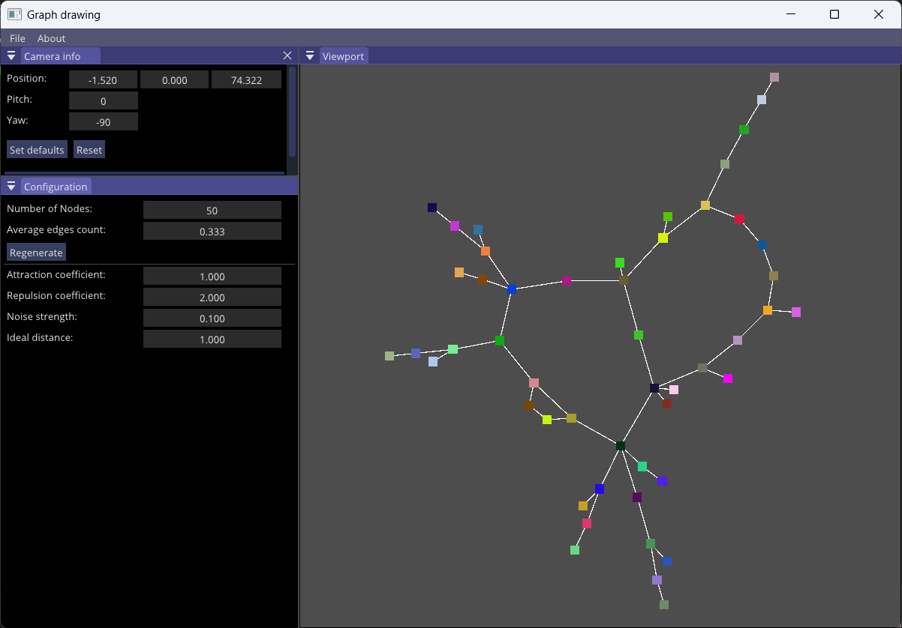

# Graph drawing 



We all work with graphs to some extent and for the longest time I use GraphViz to help me out with data visualization and debugging. For some time, I've been curious about how these graphs are generate from plain data so I decided to explore a little bit. After awhile, I stumbled upon this playlist on youtube [Force-Directed Drawing Algorithms and Tutte Embeddings](https://youtube.com/playlist?list=PLubYOWSl9mIvtnRjCCHP3wqNETTHYjQex&si=pG7m_77SKqmMq4Ey) by Philipp Kindermann.

This project uses some of the pointers given by the author in the playlist along with some of my personal takes on the subject.

## Getting started
To check available presets

```
$ cmake --list-presets
Available configure presets:

  "XXX-debug"          - Debug
  "XXX-relwithdebinfo" - RelWithDebInfo
  "XXX-release"        - Release
```

XXX could be windows or linux depending on your OS. To build preset "windows-release" for example, use the "Developer Command Prompt"
```
$ cmake --preset windows-release
$ cmake --build build/windows-release --parallel 10
```


Executables will be present under build.

